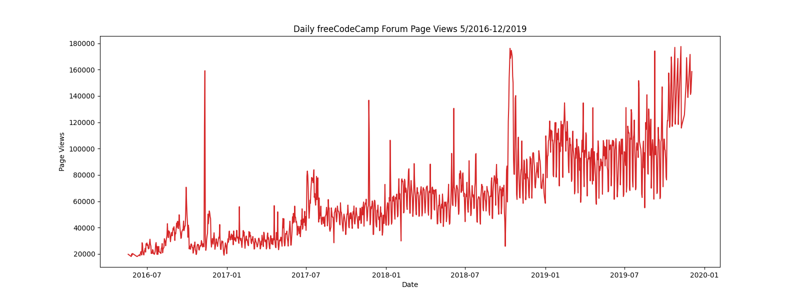
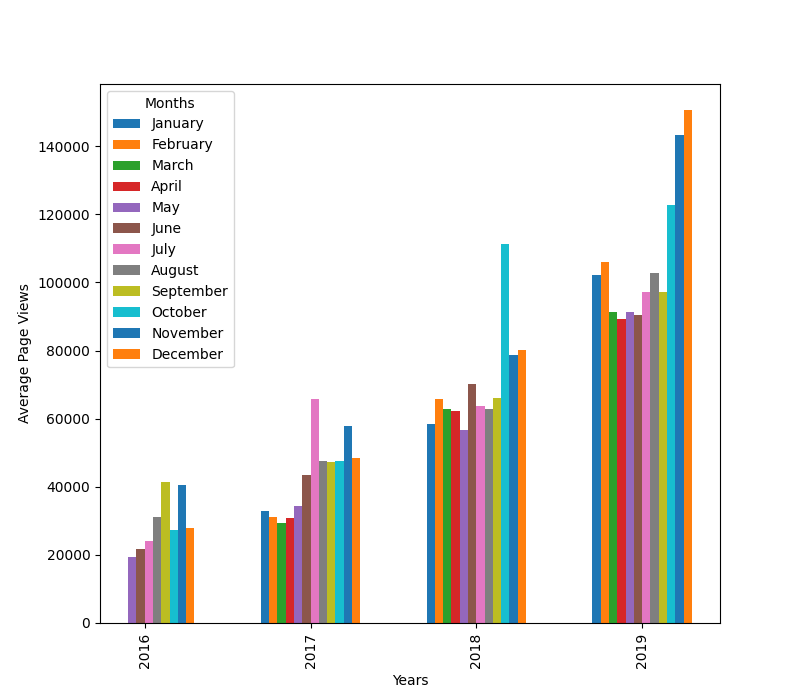
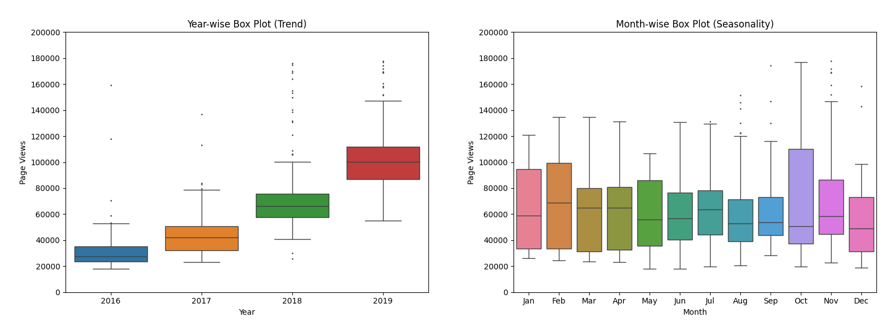

# Page View Time Series Visualizer

## Charts

  <h3>Line Chart</h3>
  

 

  <h3>Bar Chart</h3>
  

 

  <h3>Box Plot</h3>
  

 

## Built with
- [matplotlib](https://github.com/matplotlib/matplotlib) - Comprehensive library for creating static, animated, and interactive visualizations in Python
- [numpy](https://github.com/numpy/numpy) - Fundamental package for scientific computing with Python
- [pandas](https://github.com/pandas-dev/pandas) - Data analysis / manipulation library for Python
- [seaborn](https://github.com/seaborn/seaborn) - Statiscal data visualization using matplotlib
- [freeCodeCamp Page View Time Series Visualizer](https://github.com/freeCodeCamp/boilerplate-page-view-time-series-visualizer) - Tasks, boilerplate
